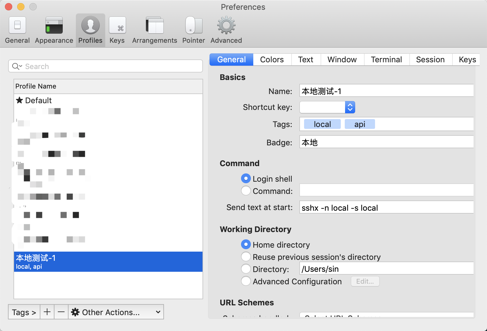
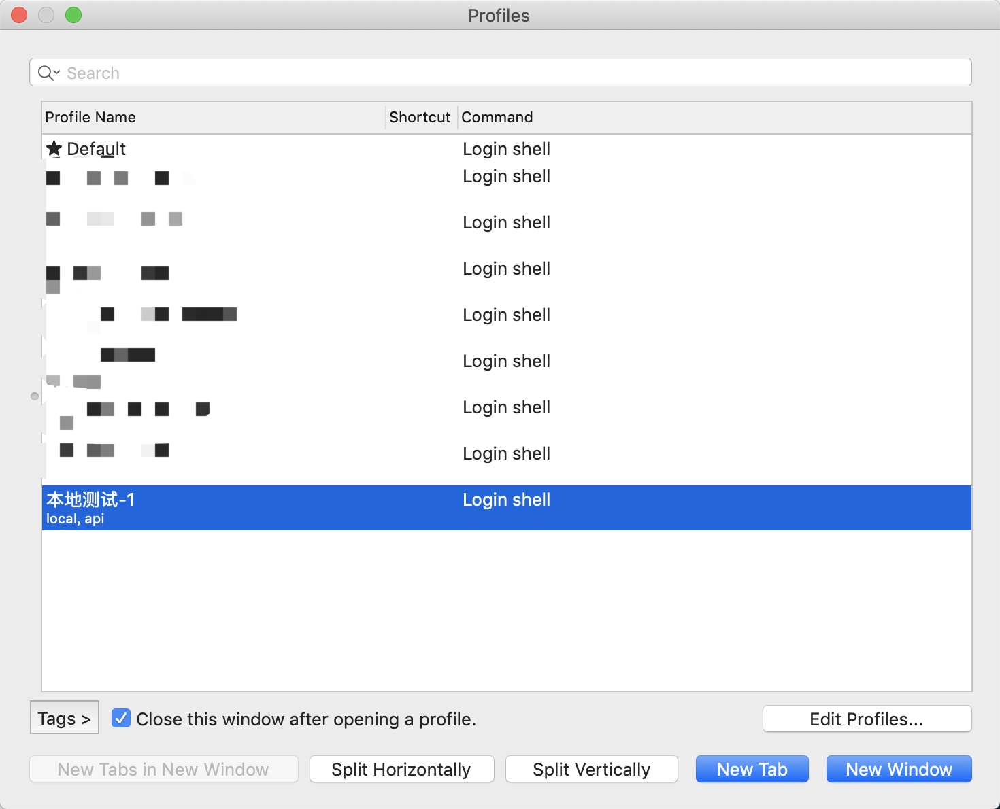
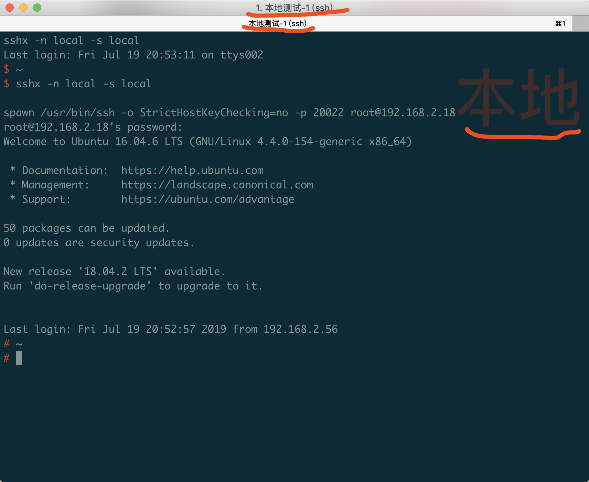

# SSHX

SSHX 将host、port、user、password经过简单混淆之后，存储在本地文件。需要连接时，按照规则解析出必要信息，使用`expect`自动输入密码连接。

SSHX 目前提供了bash、golang两种使用方式，将`sshx`文件拷贝到可执行目录，即可使用。

## 依赖

- expect：自动交互输入密码
- ssh：建立连接必须的
- md5sum：仅`shell`方式时需要，用于混淆
- bc：：仅`shell`方式时需要，用于混淆

## 使用

```shell
/yourpath/sshx -n connect_name -s connect_secret -o operation
```
- -n connect_name：连接名称
- -s connect_secret：混淆码，用于混淆存储
- -o operation：操作`add`添加、`del`删除、`con`连接（默认）

```shell
# 创建连接配置
/yourpath/sshx -n connect_name -s connect_secret -o add

# 删除连接配置
/yourpath/sshx -n connect_name -s connect_secret -o add

# 建立连接
/yourpath/sshx -n connect_name -s connect_secret -o add
/yourpath/sshx -n connect_name -s connect_secret

# 直接使用，交互输入连接名、混淆码
/yourpath/sshx 
```

## 示例
```shell
# 拷贝可执行文件到bin # 也可拷贝go编译的文件
$ cp ./shell/sshx /usr/local/bin/

# 赋予可执行权限
$ chmod +x /usr/local/bin/sshx

# 查看文件位置
$ which sshx
/usr/local/bin/sshx

# 添加连接配置
$ sshx -o add

# 连接
$ sshx
```

## iterm2
添加配置后，可通过`iterm2`的`profiles`管理连接。

`⌘ + ,`偏好设置，选择`Profiles`添加快捷连接：



`⌘ + o`打开`Profiles`列表，选择连接打开：



连接成功：



`tab`名称显示可在偏好设置 - Appearance 中勾选 `Show profie name`，可设置`Badge`在连接窗口显示。

添加的`Tags`可以方便的在连接时筛选。